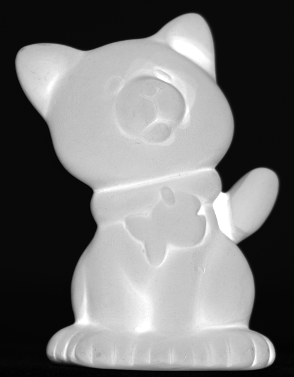

# Project 4: Stereo

project page: https://www.cs.cornell.edu/courses/cs5670/2023sp/projects/pa4/

## Downloading the dataset

Run 'sh download.sh' in the data directory to download the required datasets. For macbook, kindly run 'brew install wget' to make sure you have 'wget' to fetch the datasets.

## Testing

Run 'nosetests -v' in the project directory to run the unit tests.

# README.md

## Project: Implementation of Photometric Stereo and Plane Sweep Stereo

### Execution Time

The plane sweep stereo algorithm took 10.31 seconds to execute. This is 10x faster than the required baseline of 100s. We would like to be considered for _extra credit_.

### Results

To view the results, please refer to the images below, which are located in the `output/` folder structure of the repository:

-   
-   
-   
-   
-   
-   
-   
-   
-   
-   

### Mesh

The screenshots of the Mesh are also located in the `output/` directory of the repository:

-   
-   
-   
-   

## Implemented Functions

### 1. compute_photometric_stereo_impl(lights, images)

In this function, we aim to calculate the albedo and normal map of a Lambertian scene, given a collection of images captured from the same viewpoint and a set of light source directions. The process starts by computing the G_first_term, which is derived from the lights array. Next, we estimate the intensity values (I) for each pixel and utilize the G_first_term, lights, and intensity values to calculate the G matrix. Finally, we obtain the albedo (k_d) as the norm of G along axis 0 and the normals by normalizing G.

Essentially, this function works by examining the relationship between lighting conditions and image intensity values to determine the surface properties of the scene.

### 2. project_impl(K, Rt, points)

TThe purpose of this function is to project 3D points into a calibrated camera using the camera intrinsics calibration matrix (K), camera extrinsics calibration matrix (Rt), and an array of 3D points. We start by computing the projection matrix, which is the product of K and Rt. Then, we calculate the mapped 3D points in homogeneous coordinates through matrix multiplication. Lastly, we derive the 2D projections by dividing the x and y coordinates by the z coordinate. This function operates by transforming 3D points into 2D projections using the camera's intrinsic and extrinsic parameters, helping to establish a correspondence between the 3D world and 2D image space.

### 3. preprocess_ncc_impl(image, ncc_size)

This function is designed to preprocess an image for normalized cross-correlation (NCC) by preparing normalized patch vectors, given the image and the NCC patch size. The procedure involves computing and subtracting the mean per channel and normalizing the vector across all channels. If the norm of the vector is less than 1e-6, we set the entire vector for that patch to zero. Patches that extend beyond the input image's boundaries are also considered zero. The core functionality of this function lies in creating normalized patch vectors, which can later be employed to assess the similarity between patches in two different images.

### 4. compute_ncc_impl(image1, image2)

With this function, we calculate the normalized cross-correlation between two images that have already been preprocessed with normalized vectors for each pixel using preprocess_ncc_impl. We determine the NCC by computing the sum of the element-wise product of the input images' normalized vectors. In essence, this function gauges the similarity between the normalized vectors of the two input images, which can be useful for tasks such as stereo matching or image registration.

### Output Folder

The output folder contains the following files:

-   Flowers_depth.npy
-   Flowers_ncc.png
-   Flowers_mesh_depth.ply
-   Flowers_projected.gif
-   Flowers_ncc.gif
-   cat_albedo.png
-   cat_mesh_normals.ply
-   cat_normals.npy
-   cat_normals.png
-   tentacle_albedo.png
-   tentacle_depth.npy
-   tentacle_mesh_both.ply
-   tentacle_mesh_depth.ply
-   tentacle_ncc.gif
-   tentacle_ncc.png
-   tentacle_normals.npy
-   tentacle_normals.png
-   tentacle_projected.gif
-   flowers_meshlab_depth.png
-   meshlab_cat_normals.png
-   meshlab_tentacle_both.png
-   meshlab_tentacle_depth.png
